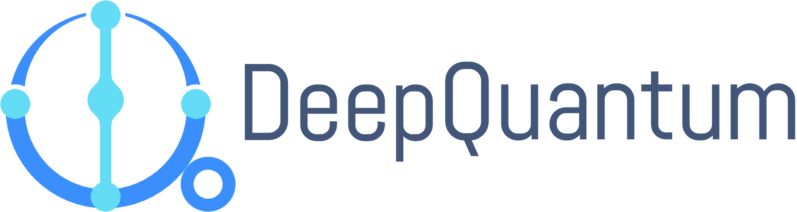

# DeepQuantum

<p align="center">
  <a href="https://github.com/TuringQ/deepquantum">
    
  </a>
</p>

[](https://dqapi.turingq.com/)
[](https://pypi.org/project/deepquantum/)

[](./LICENSE)
[](https://pypi.org/project/deepquantum/)
[](https://pepy.tech/project/deepquantum)

DeepQuantum is a platform that integrates artificial intelligence (AI) and quantum computing (QC). It is an efficient programming framework designed for quantum machine learning and photonic quantum computing. By leveraging the PyTorch deep learning platform for QC, DeepQuantum provides a powerful and easy-to-use tool for creating and simulating quantum circuits and photonic quantum circuits. This makes it ideal for developers to quickly get started and explore the field in depth. It also serves as a valuable learning platform for quantum computing enthusiasts.

# Key Features

- **AI-Enhanced Quantum Computing Framework**: Seamlessly integrated with PyTorch, it utilizes technologies such as automatic differentiation, vectorized parallelism, and GPU acceleration for efficiency. It facilitates the easy construction of hybrid quantum-classical models, enabling end-to-end training and inference.
- **User-Friendly API Design**: The API is designed to be simple and intuitive, making it easy to initialize quantum neural networks and providing flexibility in data encoding.
- **Photonic Quantum Computing Simulation**: The Photonic module includes both Fock and Gaussian backends, catering to different simulation needs in photonic quantum computing. It comes with built-in optimizers to support on-chip training of photonic quantum circuits.
- **Large-Scale Quantum Circuit Simulation**: Based on tensor networks, it enables the simulation of 100+ qubits on a laptop, leading the industry in both simulation efficiency and scale.

# Installation

Before installing DeepQuantum, we recommend first manually installing PyTorch 2.
If the latest version of PyTorch is not compatible with your CUDA version, manually install a compatible PyTorch 2 version.

The PyTorch installation instructions currently recommend:
1. Install [Miniconda](https://docs.anaconda.com/miniconda/) or [Anaconda](https://www.anaconda.com/download).
2. Setup conda environment. For example, run `conda create -n <ENV_NAME> python=3.10` and `conda activate <ENV_NAME>`.
3. Install PyTorch following the [PyTorch installation instructions](https://pytorch.org/get-started/locally/).
Currently, this suggests running `conda install pytorch -c pytorch`.

If you want to customize your installation, please follow the [PyTorch installation instructions](https://pytorch.org/get-started/locally/) to build from source.

To install DeepQuantum with `pip`, run

```bash
pip install deepquantum
# or for developers
pip install deepquantum[dev]
# or use tsinghua source
pip install deepquantum -i https://pypi.tuna.tsinghua.edu.cn/simple
```

Alternatively, to install DeepQuantum from source, run

```bash
git clone https://github.com/TuringQ/deepquantum.git
cd deepquantum
pip install -e .
# or use tsinghua source
pip install -e . -i https://pypi.tuna.tsinghua.edu.cn/simple
```

# Getting Started

To begin, please start with the tutorial on [basics](./docs/basics.ipynb).

Below are some minimal demos to help you get started.

- Quantum circuit

```python
import deepquantum as dq
cir = dq.QubitCircuit(2)
cir.h(0)
cir.cnot(0, 1)
cir.rx(1, 0.2)
cir.observable(0)
print(cir())
print(cir.expectation())
```

- Quantum circuit based on matrix product state

You can simply set `mps=True` in `QubitCircuit` and adjust the bond dimension `chi` to control the complexity.

```python
cir = dq.QubitCircuit(2, mps=True, chi=4)
cir.h(0)
cir.cnot(0, 1)
cir.rx(1, 0.2)
cir.observable(0)
print(cir())
print(cir.expectation())
```

- Photonic quantum circuit with the Fock backend, based on Fock basis state

```python
cir = dq.QumodeCircuit(2, [1,1])
cir.dc([0,1])
cir.ps(0, 0.1)
cir.bs([0,1], [0.2,0.3])
print(cir())
print(cir.measure())
```

- Photonic quantum circuit with the Fock backend, based on Fock state tensor

```python
cir = dq.QumodeCircuit(2, [(1, [1,1])], basis=False)
cir.dc([0,1])
cir.ps(0, 0.1)
cir.bs([0,1], [0.2,0.3])
print(cir())
print(cir.measure())
```

- Photonic quantum circuit with the Gaussian backend

```python
cir = dq.QumodeCircuit(2, 'vac', cutoff=10, backend='gaussian')
cir.s(0, 0.1)
cir.d(1, 0.1)
cir.bs([0,1], [0.2,0.3])
print(cir())
print(cir.measure())
print(cir.photon_number_mean_var(wires=0))
print(cir.measure_homodyne(wires=1))
```

# License

DeepQuantum is open source, released under the Apache License, Version 2.0.