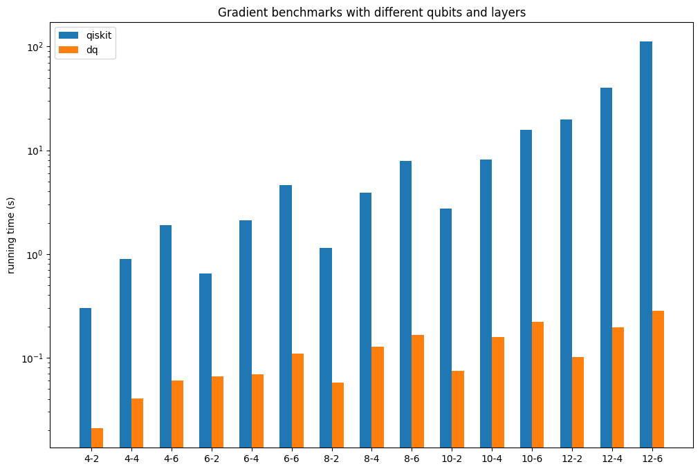

#  Application Cases

##  Hybrid Quantum-Classical Models
Hybrid quantum-classical models, combining classical neural networks with quantum neural networks, have been broadly studied and applied in areas such as image processing, recommendation systems, and combinatorial optimization.
DeepQuantum aligns seamlessly with PyTorch's programming style, enabling the convenient and natural implementation of hybrid quantum-classical models based on DeepQuantum and PyTorch.

```python
class Hybrid(nn.Module):
    def __init__(self, dim_in, nqubit):
        super().__init__()
        self.fc1 = nn.Linear(dim_in, nqubit)
        # The constructed circuit is an instance of nn.Module
        self.cir = self.circuit(nqubit)
        self.fc2 = nn.Linear(nqubit, 1)

    def circuit(self, nqubit):
        cir = dq.QubitCircuit(nqubit)
        cir.hlayer()
        # Encode classical data into the quantum circuit.
        cir.rylayer(encode=True)
        cir.rxlayer()
        cir.cnot_ring()
        for i in range(nqubit):
            cir.observable(i)
        return cir

    def forward(self, x):
        x = torch.arctan(self.fc1(x))
        # The first parameter in the forward computation
        # corresponds to the data to be encoded
        self.cir(x)
        exp = self.cir.expectation()
        out = self.fc2(exp)
        return out

nqubit = 4
batch = 2
nfeat = 8
x = torch.sin(torch.tensor(list(range(batch * nfeat)))).reshape(batch, nfeat)
net = Hybrid(nfeat, nqubit)
y = net(x)
print(y)
for i in net.named_parameters():
    print(i)
```

##  The Flexibility of Quantum Circuits

DeepQuantum supports circuit concatenation using addition, which is very flexible for the use of quantum circuits.

```python
nqubit = 2
batch = 2
data1 = torch.sin(torch.tensor(list(range(batch * nqubit)))).reshape(batch, nqubit)
data2 = torch.cos(torch.tensor(list(range(batch * nqubit)))).reshape(batch, nqubit)
cir1 = dq.QubitCircuit(nqubit)
cir1.rxlayer(encode=True)
cir2 = dq.QubitCircuit(nqubit)
cir2.rylayer(encode=True)
cir3 = dq.QubitCircuit(nqubit)
cir3.rzlayer()

data = torch.cat([data1, data2], dim=-1)
# Summing the circuits directly forms a new quantum circuit
cir = cir1 + cir3 + cir2 + cir3
cir.observable(0)
cir(data)
print(cir.expectation())
```
Of course, the above results can also be obtained through the segmented evolution of multiple sub-circuits.

```python
state = cir1(data1)
state = cir3(state=state)
state = cir2(data2, state=state)
state = cir3(state=state)
cir3.reset_observable()
cir3.observable(0)
print(cir3.expectation())
```

##  Benchmark for gradient calculation

For quantum simulators, operational efficiency is a crucial performance metric. In tasks like VQE and quantum machine learning, aside from the forward evolution of quantum circuits, gradient calculation is a pivotal factor affecting efficiency. Comparisons between DeepQuantum, Qiskit and VQNet are illustrated as follows.

```python
import time
import torch
from torch.autograd.functional import hessian
import deepquantum as dq

def benchmark(f, *args, trials=10):
    time0 = time.time()
    r = f(*args)
    time1 = time.time()
    for _ in range(trials):
        r = f(*args)
    time2 = time.time()
    if trials > 0:
        time21 = (time2 - time1) / trials
    else:
        time21 = 0
    ts = (time1 - time0, time21)
    print('staging time: %.6f s' % ts[0])
    if trials > 0:
        print('running time: %.6f s' % ts[1])
    return r, ts

def grad_dq(n, l, trials=10):
    def get_grad_dq(params):
        if params.grad != None:
            params.grad.zero_()
        cir = dq.QubitCircuit(n)
        for j in range(l):
            for i in range(n - 1):
                cir.cnot(i, i + 1)
            cir.rxlayer(encode=True)
            cir.rzlayer(encode=True)
            cir.rxlayer(encode=True)
        cir.observable(basis='x')
        cir(data=params)
        exp = cir.expectation()
        exp.backward()
        return params.grad

    return benchmark(get_grad_dq, torch.ones([3 * n * l], requires_grad=True))

def hessian_dq(n, l, trials=10):
    def f(params):
        cir = dq.QubitCircuit(n)
        for j in range(l):
            for i in range(n - 1):
                cir.cnot(i, i + 1)
            cir.rxlayer(encode=True)
            cir.rzlayer(encode=True)
            cir.rxlayer(encode=True)
        cir.observable(basis='x')
        cir(data=params)
        return cir.expectation()

    def get_hs_dq(x):
        return hessian(f, x)

    return benchmark(get_hs_dq, torch.ones([3 * n * l]))
```

The results are shown below：




##  Large-Scale Simulation

Simulating quantum circuits on classical computers demands exponentially growing computational resources as the number of qubits increases. DeepQuantum's underlying implementation of tensor network algorithms enables support for large-scale simulations.
Users simply need to set mps=True in QubitCircuit and can adjust the precision of the tensor-network-based approximate quantum state using chi. A larger chi results in greater simulation accuracy but slower runtime.

```python
batch = 2
nqubit = 100
data = torch.sin(torch.tensor(list(range(batch * nqubit)))).reshape(batch, nqubit)
cir = dq.QubitCircuit(nqubit, mps=True, chi=4)
cir.rylayer(encode=True)
cir.rxlayer()
cir.cnot_ring()
for i in range(nqubit):
    cir.observable(i)
cir(data)
print(cir.expectation())
```

##  Quantum Fourier Transform

The quantum Fourier transform is a quantum analog of the discrete Fourier transform.
DeepQuantum implements the quantum Fourier transform based on the Ansatz class (which validates the newly added arguments on top of QubitCircuit). Users can easily reproduce and develop various quantum algorithms based on the Ansatz class.
The specific implementation is provided below.

```python
class QuantumFourierTransform(dq.Ansatz):
    # the default output order of phase is x/2, ..., x/2**n
    # if reverse=True, the output order of phase is
    # x/2**n, ..., x/2
    def __init__(self, nqubit, minmax=None, reverse=False,
                 init_state='zeros', den_mat=False,
                 mps=False, chi=None, show_barrier=False):
        super().__init__(nqubit=nqubit, wires=None, minmax=minmax,
                         ancilla=None, controls=None,
                         init_state=init_state,
                         name='QuantumFourierTransform',
                         den_mat=den_mat, mps=mps, chi=chi)
        self.reverse = reverse
        for i in self.wires:
            self.qft_block(i)
            if show_barrier:
                self.barrier(self.wires)
        if not reverse:
            for i in range(len(self.wires) // 2):
                self.swap([self.wires[i], self.wires[-1 - i]])

    def qft_block(self, n):
        self.h(n)
        k = 2
        for i in range(n, self.minmax[1]):
            self.cp(i + 1, n, torch.pi / 2 ** (k - 1))
            k += 1
```

##  Quantum Phase Estimation

The Quantum Phase Estimation algorithm is a key component in many quantum algorithms. Assuming a unitary operator U acting on its eigenvector $$\ket{u}$$ introduces a phase $$e^{2{\pi}i{\psi}}$$, where the role of the phase estimation algorithm is to estimate the phase $$\psi$$.
Below is an example demonstrating the implemented Quantum Phase Estimation in DeepQuantum, specifically for the phase shift gate on a single qubit.

```python
t = 3 # The number of counting qubits
phase = 1 / 8 # Phase to be estimated
qpe = dq.QuantumPhaseEstimationSingleQubit(t, phase)
qpe()
res = qpe.measure(wires=list(range(t)))
max_key = max(res, key=res.get)
phase_est = int(max_key, 2) / 2 ** t
print(phase_est == phase)
```

##  Shor's Algorithm

Shor's Algorithm is one of the most prominent quantum algorithms, designed to solve the problem of factoring integers. Given an integer N, the goal is to find its prime factors.
Here, we demonstrate Shor's Algorithm using DeepQuantum. In the minimum example of factorizing the integer 15, a specific controlled-Ua gate is utilized to simplify the circuit.

```python
import math
from fractions import Fraction
mod = 15 # The number to be factored
a = 7 # coprime to `mod`
ncount = 8 # The number of qubits used for phase estimation
found = False
trial = 0
while not found:
    trial += 1
    print(f'\ntrial {trial}:')
    cir = dq.ShorCircuitFor15(ncount, a)
    cir()
    res = cir.measure(wires=list(range(ncount)), shots=1)
    max_key = max(res, key=res.get)
    phase = int(max_key, 2) / 2 ** ncount
    frac = Fraction(phase).limit_denominator(mod)
    r = frac.denominator
    print(f'Result: r = {r}')
    if phase != 0:
        guesses = [math.gcd(a ** (r // 2) - 1, mod), math.gcd(a ** (r // 2) + 1, mod)]
        print(f'Guessed Factors: {guesses[0]} and {guesses[1]}')
        for guess in guesses:
            if guess not in [1, mod] and (mod % guess) == 0:
                print(f'*** Non-trivial factor found: {guess} ***')
                found = True
```
Factoring other numbers using a more general circuit is possible, but it would require more computational resources and runtime.

```python
mod = 21
a = 2
ncount = 8
found = False
trial = 0
while not found:
    trial += 1
    print(f'\ntrial {trial}:')
    cir = dq.ShorCircuit(mod, ncount, a)
    cir()
    res = cir.measure(wires=list(range(ncount)), shots=1)
    max_key = max(res, key=res.get)
    phase = int(max_key, 2) / 2 ** ncount
    frac = Fraction(phase).limit_denominator(mod)
    r = frac.denominator
    print(f'Result: r = {r}')
    if phase != 0:
        guesses = [math.gcd(a ** (r // 2) - 1, mod), math.gcd(a ** (r // 2) + 1, mod)]
        print(f'Guessed Factors: {guesses[0]} and {guesses[1]}')
        for guess in guesses:
            if guess not in [1, mod] and (mod % guess) == 0:
                print(f'*** Non-trivial factor found: {guess} ***')
                found = True
```
