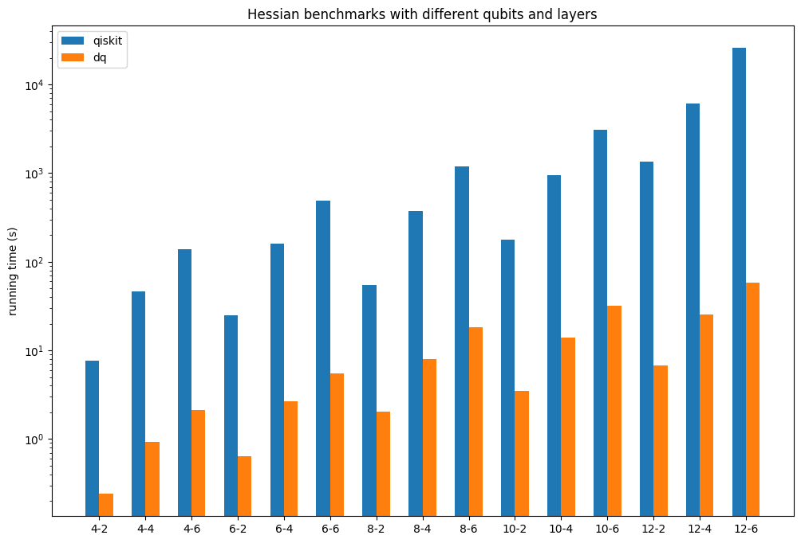

# 案例

## 混合量子-经典模型

混合量子-经典模型，即结合了经典神经网络和量子神经网络，在图像处理、推荐系统、组合优化等领域已经有了各种研究和应用。
DeepQuantum与PyTorch的编程风格完全一致，因此基于DeepQuantum和PyTorch可以很方便、自然地实现混合量子-经典模型。

```python
class Hybrid(nn.Module):
    def __init__(self, dim_in, nqubit):
        super().__init__()
        self.fc1 = nn.Linear(dim_in, nqubit)
        # 构建好的线路本身就是nn.Module
        self.cir = self.circuit(nqubit)
        self.fc2 = nn.Linear(nqubit, 1)

    def circuit(self, nqubit):
        cir = dq.QubitCircuit(nqubit)
        cir.hlayer()
        # 准备将经典数据编码到量子线路中
        cir.rylayer(encode=True)
        cir.rxlayer()
        cir.cnot_ring()
        for i in range(nqubit):
            cir.observable(i)
        return cir

    def forward(self, x):
        x = torch.arctan(self.fc1(x))
        # 前向计算的第一个参数对应于要编码的数据
        self.cir(x)
        exp = self.cir.expectation()
        out = self.fc2(exp)
        return out

nqubit = 4
batch = 2
nfeat = 8
x = torch.sin(torch.tensor(list(range(batch * nfeat)))).reshape(batch, nfeat)
net = Hybrid(nfeat, nqubit)
y = net(x)
print(y)
for i in net.named_parameters():
    print(i)
```

## 量子线路的灵活性

DeepQuantum支持通过加法来对线路进行拼接，对于量子线路的使用非常灵活。

```python
nqubit = 2
batch = 2
data1 = torch.sin(torch.tensor(list(range(batch * nqubit)))).reshape(batch, nqubit)
data2 = torch.cos(torch.tensor(list(range(batch * nqubit)))).reshape(batch, nqubit)
cir1 = dq.QubitCircuit(nqubit)
cir1.rxlayer(encode=True)
cir2 = dq.QubitCircuit(nqubit)
cir2.rylayer(encode=True)
cir3 = dq.QubitCircuit(nqubit)
cir3.rzlayer()

data = torch.cat([data1, data2], dim=-1)
cir = cir1 + cir3 + cir2 + cir3 # 线路相加后直接形成一个新的量子线路
cir.observable(0)
cir(data)
print(cir.expectation())
```

当然，上面的结果也可以由多个子线路的分段演化得到。

```python
state = cir1(data1)
state = cir3(state=state)
state = cir2(data2, state=state)
state = cir3(state=state)
cir3.reset_observable()
cir3.observable(0)
print(cir3.expectation())
```

## 梯度计算的benchmark

对于量子模拟器来说，运行效率是最重要的评价指标之一。对于VQE和量子机器学习等任务，除了量子线路的前向演化，梯度的计算是影响运行效率的最重要的因素。下面展示了DeepQuantum和Qiskit、VQNet的对比。

```python
import time
import torch
from torch.autograd.functional import hessian
import deepquantum as dq

def benchmark(f, *args, trials=10):
    time0 = time.time()
    r = f(*args)
    time1 = time.time()
    for _ in range(trials):
        r = f(*args)
    time2 = time.time()
    if trials > 0:
        time21 = (time2 - time1) / trials
    else:
        time21 = 0
    ts = (time1 - time0, time21)
    print('staging time: %.6f s' % ts[0])
    if trials > 0:
        print('running time: %.6f s' % ts[1])
    return r, ts

 def grad_dq(n, l, trials=10):
    def get_grad_dq(params):
        if params.grad != None:
            params.grad.zero_()
        cir = dq.QubitCircuit(n)
        for j in range(l):
            for i in range(n - 1):
                cir.cnot(i, i + 1)
            cir.rxlayer(encode=True)
            cir.rzlayer(encode=True)
            cir.rxlayer(encode=True)
        cir.observable(basis='x')
        cir(data=params)
        exp = cir.expectation()
        exp.backward()
        return params.grad

    return benchmark(get_grad_dq, torch.ones([3 * n * l], requires_grad=True))

def hessian_dq(n, l, trials=10):
    def f(params):
        cir = dq.QubitCircuit(n)
        for j in range(l):
            for i in range(n - 1):
                cir.cnot(i, i + 1)
            cir.rxlayer(encode=True)
            cir.rzlayer(encode=True)
            cir.rxlayer(encode=True)
        cir.observable(basis='x')
        cir(data=params)
        return cir.expectation()

    def get_hs_dq(x):
        return hessian(f, x)

    return benchmark(get_hs_dq, torch.ones([3 * n * l]))
```

具体结果如下图所示：





## 大规模模拟

用经典计算机对量子线路进行模拟，所需的计算资源会随着量子比特数的增加而呈指数级增长。DeepQuantum底层实现了张量网络算法，得以支持大规模的模拟。
用户只需要设置QubitCircuit的mps=True即可，并且可以用chi来调节基于张量网络近似量子态的精度，chi越大模拟精度越高，运行速度越慢。

```python
batch = 2
nqubit = 100
data = torch.sin(torch.tensor(list(range(batch * nqubit)))).reshape(batch, nqubit)
cir = dq.QubitCircuit(nqubit, mps=True, chi=4)
cir.rylayer(encode=True)
cir.rxlayer()
cir.cnot_ring()
for i in range(nqubit):
    cir.observable(i)
cir(data)
print(cir.expectation())
```

## 量子傅里叶变换

量子傅里叶变换是离散傅里叶变换的量子对应。
DeepQuantum基于Ansatz类实现了量子傅里叶变换（Ansatz类只是在QubitCircuit的基础上对新增的输入参数进行了有效性的判断）。用户同样可以基于Ansatz类来方便地复现和开发各种量子算法。
下面是具体的实现。

```python
class QuantumFourierTransform(dq.Ansatz):
    # the default output order of phase is x/2, ..., x/2**n
    # if reverse=True, the output order of phase is
    # x/2**n, ..., x/2
    def __init__(self, nqubit, minmax=None, reverse=False,
                 init_state='zeros', den_mat=False,
                 mps=False, chi=None, show_barrier=False):
        super().__init__(nqubit=nqubit, wires=None, minmax=minmax,
                         ancilla=None, controls=None,
                         init_state=init_state,
                         name='QuantumFourierTransform',
                         den_mat=den_mat, mps=mps, chi=chi)
        self.reverse = reverse
        for i in self.wires:
            self.qft_block(i)
            if show_barrier:
                self.barrier(self.wires)
        if not reverse:
            for i in range(len(self.wires) // 2):
                self.swap([self.wires[i], self.wires[-1 - i]])

    def qft_block(self, n):
        self.h(n)
        k = 2
        for i in range(n, self.minmax[1]):
            self.cp(i + 1, n, torch.pi / 2 ** (k - 1))
            k += 1
```

## 量子相位估计

量子相位估计算法是很多量子算法的关键。假设一个幺正算符U作用在其本征态 |u⟩ 上会出现一个相位 $e^{2{\pi}i{\psi}}$ ，相位估计算法的作用就是对这个相位 $\psi$ 进行估计。
下面演示的是DeepQuantum中已经实现的量子相位估计的例子，即针对单量子比特的相移门，得到它的相位。

```python
t = 3 # 用来估计相位的qubit数量
phase = 1 / 8 # 待估计的相位
qpe = dq.QuantumPhaseEstimationSingleQubit(t, phase)
qpe()
res = qpe.measure(wires=list(range(t)))
max_key = max(res, key=res.get)
phase_est = int(max_key, 2) / 2 ** t
print(phase_est == phase)
```

## Shor算法

Shor算法是最知名的量子算法之一，其要解决的问题是：给定一个整数N，找出它的质因数。
下面我们用DeepQuantum来演示Shor算法，在分解整数15的最小案例中，使用了特定的受控Ua门来简化线路。

```python
import math
from fractions import Fraction
mod = 15 # 待分解的数
a = 7 # 与待分解的`mod`互质
ncount = 8 # 用来估计相位的qubit数量
found = False
trial = 0
while not found:
    trial += 1
    print(f'\ntrial {trial}:')
    cir = dq.ShorCircuitFor15(ncount, a)
    cir()
    res = cir.measure(wires=list(range(ncount)), shots=1)
    max_key = max(res, key=res.get)
    phase = int(max_key, 2) / 2 ** ncount
    frac = Fraction(phase).limit_denominator(mod)
    r = frac.denominator
    print(f'Result: r = {r}')
    if phase != 0:
        guesses = [math.gcd(a ** (r // 2) - 1, mod), math.gcd(a ** (r // 2) + 1, mod)]
        print(f'Guessed Factors: {guesses[0]} and {guesses[1]}')
        for guess in guesses:
            if guess not in [1, mod] and (mod % guess) == 0:
                print(f'*** Non-trivial factor found: {guess} ***')
                found = True
```

也可以使用更通用的线路来分解其他数，但会需要更多的计算资源和运行时间。

```python
mod = 21
a = 2
ncount = 8
found = False
trial = 0
while not found:
    trial += 1
    print(f'\ntrial {trial}:')
    cir = dq.ShorCircuit(mod, ncount, a)
    cir()
    res = cir.measure(wires=list(range(ncount)), shots=1)
    max_key = max(res, key=res.get)
    phase = int(max_key, 2) / 2 ** ncount
    frac = Fraction(phase).limit_denominator(mod)
    r = frac.denominator
    print(f'Result: r = {r}')
    if phase != 0:
        guesses = [math.gcd(a ** (r // 2) - 1, mod), math.gcd(a ** (r // 2) + 1, mod)]
        print(f'Guessed Factors: {guesses[0]} and {guesses[1]}')
        for guess in guesses:
            if guess not in [1, mod] and (mod % guess) == 0:
                print(f'*** Non-trivial factor found: {guess} ***')
                found = True
```